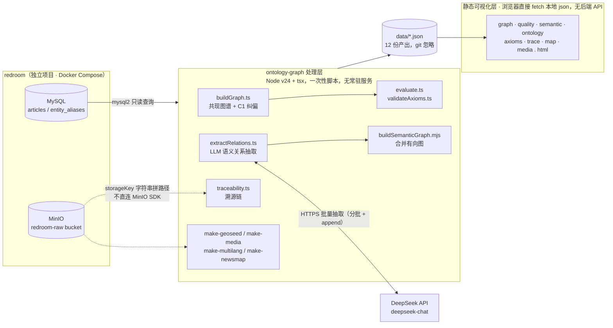
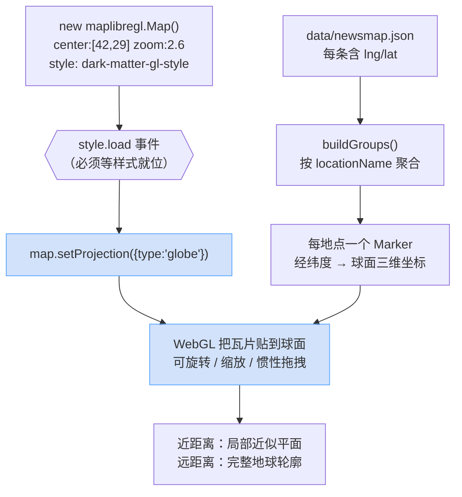

# ontology-graph 架构说明文档

地缘情报多模态多语种知识工程系统。从 redroom 采集的原始新闻数据出发，构建实体关系图谱、抽取语义关系、定义领域本体、建立可量化质量评价，并提供完整可溯源的地理与多模态检索视图。

本项目与 redroom 是两个独立的 Git 仓库，通过同一个 MySQL 实例与 MinIO bucket 解耦协作：**redroom 只写，ontology-graph 只读**。ontology-graph 没有常驻服务——所有处理都是"跑一次脚本、落地一份 JSON"，可视化层是 8 个纯静态 HTML 页面，直接在浏览器里 `fetch` 本地 JSON，没有后端 API、没有登录态。

**目录**

1. [技术架构图](#1-技术架构图)
2. [技术栈](#2-技术栈)
3. [数据流水线：各阶段说明](#3-数据流水线各阶段说明)
4. [3D 球体渲染层](#4-3d-球体渲染层)
5. [交互时序图：新闻事件地图](#5-交互时序图新闻事件地图maphtml)
6. [已知边界](#6-已知边界)
7. [运行方式](#7-运行方式)

---

## 1. 技术架构图



**几个容易忽略但影响设计判断的事实：**

- ontology-graph 从不直接访问 MinIO 对象——`minioPath` 只是把 MySQL 里的 `storageKey` 字段拼成 `redroom-raw/${storageKey}` 这样一个可点击的定位字符串，真正的图片/原文加载走的是 `articles.imageUrl` / `articles.url`（外链），不经过本项目。
- 除 `extractRelations.ts` 会调用 DeepSeek API 外，其余所有脚本都只读 MySQL，是纯离线的图计算 / 规则处理，不产生网络请求。
- 8 个 HTML 页面之间没有共享状态，也没有构建步骤（无 webpack/vite），每个页面的 `<script>` 里直接写 vanilla JS。

---

## 2. 技术栈

| 层 | 技术 | 版本/说明 |
|---|---|---|
| 数据源 | MySQL（redroom 库，宿主机 3307） | 只读；`articles` 表 + `entity_aliases` 归一化表 |
|  | MinIO（redroom-raw bucket） | 只以字符串路径引用，不直连 SDK |
| LLM | DeepSeek Chat API | `extractRelations.ts` 结构化抽取 12 类关系，支持分批 + `append` 追加 |
| 运行时 | Node.js v24 + `tsx` | TypeScript 文件直接跑，无编译步骤；`mysql2`/`dotenv` 为主要依赖 |
| 图谱可视化 | vis-network@9.1.9 | `graph.html`（共现图谱）、`semantic.html`（语义关系有向图） |
| 图表 | chart.js@4.4.0 | `quality.html` 雷达图 |
| 地图 | MapLibre GL JS@5.24.0 | `map.html`，`dark-matter-gl-style` 底图 + `setProjection({type:"globe"})` 3D 地球投影（globe 是 5.0+ 才有的 API，6.x 起不再提供传统 `<script>` 可用的 UMD 包，故锁定在 5.24.0） |
| 其余 5 页 | 无第三方库 | `ontology.html`/`axioms.html`/`trace.html`/`media.html` 均为 vanilla JS + `fetch` |
| 部署 | `npx serve .` | 静态文件服务器；无鉴权、无会话 |

> **版本踩坑记录**：最初锁定的 4.7.1 其实没有 `setProjection` 方法——globe 投影是 MapLibre **5.0** 才加入的 API，代码调用它是静默失效的，地图实际渲染的一直是平面墨卡托投影，不是真正的 3D 球体。直接升到最新的 6.x 又会 404——6.0 起不再提供传统 `<script src>` 能用的 UMD 打包文件，只发 ES Module（`maplibre-gl.mjs`）。最终锁定 **5.24.0**（5.x 系列最后一版）：既有 globe API，又保留 UMD 包，不用为了一个投影改动把全页脚本重构成 ES Module。同时把触发时机从 `load` 事件改成 MapLibre 官方示例推荐的 `style.load` 事件。

---

## 3. 数据流水线：各阶段说明

| # | 阶段 | 脚本 | 产出 | 页面 |
|---|---|---|---|---|
| 1 | 实体共现图谱 | `src/buildGraph.ts` | `data/graph.json` | `graph.html` |
| 2 | 五维度质量评价 | `src/evaluate.ts` | `data/quality-report.json` | `quality.html` |
| 3 | LLM 语义关系抽取 | `src/extractRelations.ts <篇数> <偏移> [append]` | `data/relations.json` | `semantic.html` |
| 4 | 本体 Schema | `src/ontology.ts` → `export-ontology.mjs` | `data/ontology.json` | `ontology.html` |
| 4b | 公理合规检测 | `src/validateAxioms.ts` | `data/axiom-report.json` | `axioms.html` |
| 5 | 情报溯源链 | `src/traceability.ts` | `data/traceability.json` | `trace.html` |
| 6 | 地理可视化 + 新闻事件地图 | `make-geoseed.mjs` + `make-newsmap.mjs` | `data/geo-seed.json`/`geo-nodes.json`/`newsmap.json` | `map.html` |
| 7 | 多模态多语种检索 | `make-media.mjs` + `make-multilang.mjs` | `data/media.json`/`multilang.json` | `media.html` |

**阶段 1 — 共现图谱**（`buildGraph.ts`，151 行）：读全部 `entitiesJson` 非空文章，实体先过 `entity_aliases` 归一化（同名多语言/多拼写合并为一个 `canonicalZh`），同篇文章内的实体两两连边、边权 = 共现次数。内置**公理 C1 自动纠偏**：任何在已知国家名单里、但类型被误标为 `organization` 的实体会被强制改回 `location`，纠偏日志写入 `data/type-fix-log.json`，对每次新抓的数据都会重新执行，不需要手动干预。

**阶段 2 — 质量评价**（`evaluate.ts`，231 行）：五个一级维度（准确性/完整性/一致性/连通性/时效性），每个维度都有可复现的算法和问题样本，不是主观打分。当前综合分 96.2/100。

**阶段 3 — 语义关系抽取**（`extractRelations.ts`，162 行）：调用 DeepSeek 把文章原文结构化为 `(主体, 关系, 客体)` 三元组，关系限定在 12 类（冲突：攻击/威胁/敌对；合作：结盟/支持/谈判；外交：制裁/谴责/协议；结构：隶属/位于/涉及）。因为耗时长、耗 LLM 额度，设计成可分批跑（`<篇数> <偏移量>`）并用 `append` 模式追量，日常增量抓取不需要重跑全量。

**阶段 4 — 本体 Schema**（`src/ontology.ts`，234 行）：22 个类（`Country` 独立于 `Organization` 之外成顶层类；`Event` 拆成 `ConflictEvent`/`DiplomaticEvent`/`EconomicEvent`/`HumanitarianEvent` 四个子类；含多模态 `MediaResource` 类）、15 种关系（带反向语义和基数约束）、7 条公理。每个实体带三语标签（`canonicalZh`/`canonicalEn`/`canonicalAr`，覆盖率 100%/100%/41%），阿语标签是从 `entity_aliases.raw` 里用 Unicode 范围正则挑出来的，不是翻译生成的。

**阶段 4b — 公理合规检测**（`validateAxioms.ts`，138 行）：把 7 条公理当作可执行的评价规则跑一遍，C1/C3/C5/C7 已经能自动检测违规样本并映射到质量维度扣分；C2（设施必有归属）/C4（人物单一国籍）/C6（地理唯一约束）依赖属性 schema 尚未启用，页面上明确标注"待第二步"而不是隐藏掉。

**阶段 5 — 溯源链**（`traceability.ts`，108 行）：每条语义三元组回链到源文章、MinIO 原始 JSON 路径、以及新闻配图，做到 100% 可溯源到文章 + MinIO，约 42.8% 能关联到配图（构成多模态溯源）。

**阶段 6 — 地理可视化**：`make-geoseed.mjs` 给 50 个高频地理实体配上经纬度种子坐标，供本体实体地图（`map.html` 早期形态）使用；`make-newsmap.mjs`（106 行，本次交接新增）是这一阶段的延伸——单独查询近 3 天文章，把 `entitiesJson.locations` 归一化后去种子表里找坐标，命中就产出一条新闻事件记录，`map.html` 据此把同地点的事件聚合成一个标识（见第 4 节时序图）。

**阶段 7 — 多模态多语种检索**：`make-media.mjs` 抓所有带图文章供 `media.html` 做文本→图像检索；`make-multilang.mjs` 为高频实体生成中英阿三语标签供跨语言检索。

---

## 4. 3D 球体渲染层

地图不是平面投影加了个倾角，而是 MapLibre 的真·球体投影：底图瓦片被贴到一个三维球面上，可以拖拽旋转、缩放，靠近时自动过渡到接近平面的局部视角。



**关键点：**

- **投影必须在 `style.load` 之后设置**，不能在 `new Map()` 的构造参数里指定，也不宜挂在 `load` 事件上——样式未就位时调用会失效。这是 MapLibre 官方 globe 示例的标准写法。
- **Marker 的经纬度不需要为球体做任何转换**：仍然是 `setLngLat([lng, lat])`，MapLibre 内部负责把经纬度映射到球面三维坐标，并在地球背面自动隐藏标识。这意味着从平面切到球体，`renderMarkers()` 一行都不用改。
- **`flyTo` 在球体下变成球面弧线飞行**，视觉上是地球转过去而不是画面平移，这个效果是投影切换白送的，不需要额外代码。
- **底图样式沿用 `dark-matter-gl-style`**，和整个项目的深色系页面保持一致；球体外的空白区域即页面背景色（`#0d1117`），不额外加星空/大气层贴图，避免喧宾夺主。

---

## 5. 交互时序图：新闻事件地图（map.html）

`map.html` 是唯一有复杂前端交互状态机的页面，其余 7 页基本是"拉数据 → 渲染 → 结束"。下图拆成两段：**构建期**（离线生成数据）和**运行期**（浏览器里的实际交互）。

```mermaid
sequenceDiagram
  autonumber
  participant Build as make-newsmap.mjs（构建期，离线）
  participant DB as MySQL（近 3 天 articles）
  participant JSON as data/newsmap.json
  participant U as 用户
  participant JS as map.html 前端脚本
  participant Globe as MapLibre 球体
  participant List as 侧栏新闻列表
  participant Marker as 聚合标识（一地点一个）
  participant Popup as 事件浮窗

  rect rgb(30, 35, 42)
  Note over Build,JSON: 构建期
  Build->>DB: SELECT ... WHERE publishedAt >= NOW()-3d
  DB-->>Build: 文章 + entitiesJson + storageKey
  Build->>Build: locations 归一化 → 匹配 geo-seed 坐标\nstorageKey 前缀 → eventType
  Build->>JSON: 写入（lng/lat/eventType/minioPath）
  end

  rect rgb(22, 27, 34)
  Note over U,Popup: 运行期
  U->>JS: 打开 map.html
  JS->>Globe: new Map() → style.load\n→ setProjection({type:"globe"})
  Globe-->>U: 渲染 3D 地球（可旋转/缩放）
  JS->>JSON: fetch
  JS->>JS: buildGroups()：按 locationName 聚合
  JS->>Marker: renderMarkers()：数量徽标，标识本身不分类型
  Marker->>Globe: setLngLat() → 贴到球面\n（背面标识自动隐藏）
  JS->>List: render()：卡片按类型上色 + 徽章

  U->>Marker: 点击某地点标识
  Marker->>JS: click
  JS->>JS: closeAllPopups()
  JS->>Popup: popup.addTo(map)
  Popup-->>U: 该地点全部事件（可滚动，逐条带分类徽章）

  U->>Popup: 点击具体一条事件
  Popup->>JS: row click
  JS->>List: activeId 高亮对应卡片
  JS->>U: window.open(原文链接, "_blank")

  U->>List: 点击列表中某条新闻
  List->>JS: selectNews(articleId)
  JS->>Globe: map.flyTo(该新闻坐标)
  Globe-->>U: 地球沿球面弧线转到该位置
  JS->>Popup: 打开对应地点浮窗\n滚动定位并高亮该条
  end
```



**几个决定这套交互形态的取舍：**

- 标识从"每篇文章一个"改成"每地点一个"，是因为同地点事件密集（如"伊朗"3 天内 78 条）时逐条打点会完全重叠、互相遮挡；聚合后标识只承载数量信息，分类色彩下放到列表卡片和浮窗行里，避免标识本身信息过载。
- 悬停 → 点击：浮窗内容需要滚轮翻阅和点击跳转，鼠标必须能在标识和浮窗之间自由移动，纯悬停容易因为鼠标移动路径问题误关闭；改成点击触发后浮窗持久开启，靠再点一次或点其他标识来切换，多了一个关闭按钮兜底。
- 点击浮窗内一行不是"选中"而是直接 `window.open` 跳原文——用户点开浮窗本身就是"我想看这条"的信号，不需要再多一步确认。

---

## 6. 已知边界

这些不是 bug，是当前阶段有意为之或依赖后续数据的限制：

- **`articles.topics` 字段实际为空**——`make-newsmap.mjs` 的事件分类改用 `storageKey` 的 MinIO 目录前缀（`technology/`、`war-conflict/` 等）反推，不依赖这个空字段。
- **`country` 字段约 60% 缺失**，所有地理定位统一走 `entitiesJson.locations` + 归一化，不用 `country`。
- **50 个地理种子坐标**只覆盖高频地点，近 3 天约 1300 篇文章里能定位坐标的约 800 篇（~60%），其余因为提不到已知地点被跳过，不做模糊定位。
- **公理 C2/C4/C6** 依赖尚未建立的实体属性 schema（设施归属、人物国籍、地理唯一性），页面上标注"待第二步"，不是检测失败。
- **阿语标签覆盖率 41%**——是从原始抓取文本里挑出来的阿语原文，不是机器翻译补全，所以覆盖率如实反映数据本身。
- **MapLibre 锁定 5.24.0 不跟进 6.x**——6.x 起只发 ES Module，升级需要把页面脚本改造成 `type="module"`，收益不足以支撑这个改动，除非将来有必须用到的 6.x 新特性。

---

## 7. 运行方式

```bash
# 前置：redroom 的 MySQL / MinIO 容器需运行
npm install
copy .env.example .env

npx tsx src/buildGraph.ts
node make-viz.mjs
npx tsx src/evaluate.ts
npx tsx export-ontology.mjs
npx tsx src/validateAxioms.ts
npx tsx src/traceability.ts
node make-geoseed.mjs
node make-media.mjs
node make-multilang.mjs
node buildSemanticGraph.mjs
node make-newsmap.mjs

npx serve .   # 浏览器打开 8 个 html 页面
```

`extractRelations.ts` 是唯一需要单独决定要不要跑的一步——它耗时长、耗 LLM 额度，只有数据源有大量新增内容需要重新覆盖语义关系时才需要重跑，日常增量抓取不需要。
