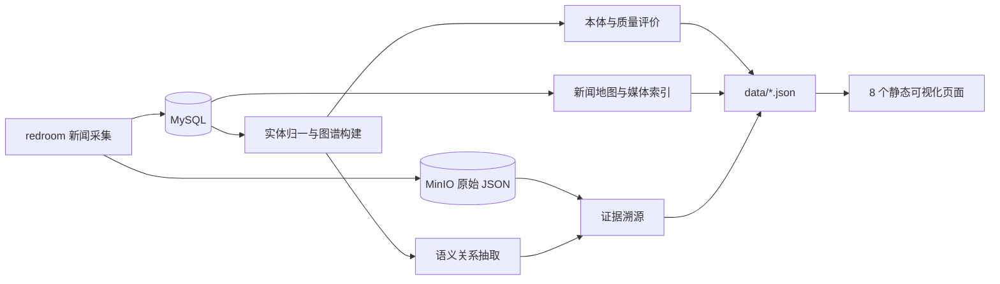

# ontology-graph 项目最终交付说明

## 1. 项目概述

本项目面向地缘情报知识工程场景，以 redroom 新闻采集平台的文章、实体别名和原始 JSON 为数据源，形成“采集数据—知识图谱—领域本体—质量评价—证据溯源—地理与多模态应用”的完整链路。

- 仓库：[jzgw249-web/ontology-graph](https://github.com/jzgw249-web/ontology-graph)
- 主分支：`main`
- 环境：Node.js 24、npm、MySQL、MinIO
- 数据关系：redroom 写入，本项目只读，通过 MySQL / MinIO 解耦
- 安全边界：`.env` 和 `data/*.json` 不进入 Git

## 2. 交付清单

| 内容 | 文件 | 说明 |
|---|---|---|
| 项目入口 | `README.md` | 功能、环境、运行与数据生成说明 |
| 架构设计 | `ARCHITECTURE.md` | 技术架构图、数据流水线、地图交互时序和 3D 扩展设计 |
| 最终交付 | `PROJECT_DELIVERY.md` | 本文档，供验收、移交和维护使用 |
| 核心源码 | `src/*.ts` | 图谱、本体、关系抽取、评价、公理验证和溯源 |
| 数据脚本 | `make-*.mjs` 等 | 生成前端所需 JSON |
| 可视化 | 8 个 `*.html` | 独立静态页面，无前端编译步骤 |
| 配置模板 | `.env.example` | 仅包含配置字段，不含真实密钥 |

## 3. 已完成成果

| 阶段 | 成果 | 页面 |
|---|---|---|
| 共现图谱 | 约 5965 个实体、23600 条边，公理 C1 自动纠正国家类型 | `graph.html` |
| 质量评价 | 准确性、完整性、一致性、连通性、时效性五维评价 | `quality.html` |
| 语义关系 | 约 4483 个三元组、12 类关系 | `semantic.html` |
| 本体 Schema | 22 个类、15 种关系、7 条公理，中英阿标签体系 | `ontology.html` |
| 公理检测 | C1/C3/C5/C7 自动检测，违规明细和维度扣分 | `axioms.html` |
| 证据溯源 | 三元组回溯至文章、MinIO 原始 JSON 和新闻配图 | `trace.html` |
| 新闻地图 | 近 3 天新闻、地点聚合标识、3D 地球和建筑层 | `map.html` |
| 跨模态检索 | 中/英/阿文本检索相关新闻图片 | `media.html` |

本地最近一次新闻地图数据包含 809 条成功定位新闻、47 个地点；该数字随抓取时间变化。

## 4. 数据流程



完整组件关系、地图交互时序和三维扩展方案见 `ARCHITECTURE.md`。

## 5. 复现步骤

前置条件：安装 Node.js 24，启动 redroom 的 MySQL 与 MinIO，并将 `.env.example` 复制为本地 `.env` 后填写连接信息。真实密码和 API Key 不得写入文档、日志或 commit；建议轮换曾在历史对话中暴露的 LLM Key。

```powershell
npm install
npx tsx src/buildGraph.ts
node make-viz.mjs
npx tsx src/evaluate.ts
npx tsx export-ontology.mjs
npx tsx src/validateAxioms.ts
npx tsx src/traceability.ts
node make-geoseed.mjs
node make-newsmap.mjs
node make-media.mjs
node make-multilang.mjs
node buildSemanticGraph.mjs
npx serve .
```

`src/extractRelations.ts` 会调用外部 LLM，耗时且消耗额度。日常不必重跑；数据量明显增长时再按 `npx tsx src/extractRelations.ts <篇数> <offset> append` 分批追加。

## 6. 页面验收

启动静态服务器后逐一打开：

- `graph.html`：实体共现图谱
- `quality.html`：五维质量评价
- `semantic.html`：语义关系图
- `ontology.html`：本体 Schema
- `axioms.html`：公理合规检测
- `trace.html`：证据溯源链
- `map.html`：近 3 天新闻事件地图
- `media.html`：多模态多语种检索

地图应正常显示左侧新闻列表；同一地点只显示一个带事件数量的标识；点击标识出现可滚动新闻列表；点击新闻打开原文。地图采用 MapLibre 3D 球体和简体中文地名，高缩放级别显示矢量建筑拉伸层。第三方实景 3D Tiles 试验已撤回，当前无相关密钥依赖。

## 7. 增量更新

1. 在 redroom 中完成抓取、标题补翻译、实体归一化和 MinIO 回填。
2. 回到本项目运行 `node make-newsmap.mjs` 更新近 3 天地图。
3. 需要更新全部成果时，按“复现步骤”执行。
4. 只有新增规模足够大时才追加 LLM 关系抽取。

## 8. 已知边界

- `data/*.json` 因体积和更新频率被 Git 忽略，首次检出后需本地生成。
- 地图依赖地点实体、别名归一化和约 50 个坐标种子；无法匹配的新闻不显示。
- 城市建筑来自矢量瓦片高度拉伸，是三维白模，不是摄影测量实景模型。
- 阿拉伯语标签覆盖率取决于原始信源。
- LLM 抽取结果受模型和数据质量影响，重要关系仍需抽样复核。
- 登录和采集属于 redroom 项目职责，不在本项目实现。

## 9. 后续建议

1. 扩充全球地名坐标和别名字典，提高地图定位覆盖率。
2. 引入带置信度、可审计的地名解析服务。
3. 接入合规授权的遥感影像、DEM、倾斜摄影或 3D Tiles。
4. 为增量关系抽取记录模型、提示词版本并增加人工复核。
5. 增加统一 npm scripts、自动化测试和 CI 文档检查。

## 10. 交付检查

- [x] 最新源码与正式文档纳入 Git 管理
